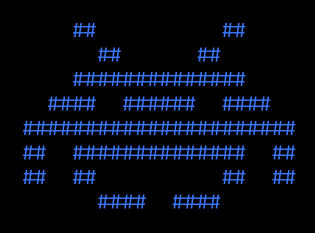

# Space Invaders clone/test

A classic arcade shooter clone game built with HTML5 Canvas and JavaScript, mainly for learning and testing.



## 🎮 Game Features

- Classic space shooter gameplay with player tank and alien invaders
- Progressive difficulty - enemies get faster with each wave
- Score tracking and lives system
- Beautiful retro styling with glowing effects (haha :P)
- Responsive controls (arrow keys to move, spacebar to shoot)
- Starry background for immersive experience

## 🚀 How to Play

### Controls:

- **← → Arrow Keys**: Move your spaceship left and right
- **Spacebar**: Fire laser shots at enemies

### Objective:

Destroy all alien invaders before they reach the bottom of the screen. Each enemy destroyed gives you 100 points.

## 🛠️ Technical Implementation

### Game Structure:

```javascript
// Game state management
let gameRunning = true;
let score = 0;
let lives = 3;

// Player object
const player = {
  x: canvas.width / 2 - 25,
  y: canvas.height - 60,
  width: 50,
  height: 40,
  speed: 7,
};

// Enemy grid system
const enemyRows = 4;
const enemyCols = 5;
let enemies = [];
```

### Key Components:

1. **Player Tank**: Green tank that you control at the bottom of the screen
2. **Enemies**: Red triangular ships that move in formation and shoot back
3. **Bullets**:
   - Player bullets (cyan) fire upward
   - Enemy bullets (red) fire downward

### Game Mechanics:

- Enemies automatically move horizontally, changing direction when hitting screen edges
- When enemies reach the bottom, game ends
- Progressive difficulty increases with each wave
- Collision detection for all game objects
- Starry background for visual appeal

## 🎯 Game Elements

### Player:

- **Health**: 3 lives
- **Movement**: Horizontal only (left/right)
- **Shooting**: Spacebar to fire lasers

### Enemies:

- **Formation**: 4 rows × 5 columns of invaders
- **Behavior**: Move horizontally, shoot randomly
- **Death**: Destroyed when hit by player bullets

### Scoring:

- Each enemy destroyed: +100 points
- Enemy shooting: Reduces lives if player is hit
- Wave completion: Enemies reset with increased speed

## 📁 File Structure

```
space-invaders/
├── SpaceInvaders-clone.html
└── README.md (this file)
```

## 🔧 Setup Instructions

1. **Clone or download** the repository
2. Open `SpaceInvaders-clone.html` in any modern web browser
3. Start playing immediately!

No additional dependencies required - everything is self-contained in a single HTML file.

## 🎨 Visual Design

### Color Scheme:

- Background: Deep space blue gradient (`#0c1445` to `#1a237e`)
- Player Tank: Bright green (`#00ff00`) with details
- Enemies: Red (`#ff0000`) with blue cockpit details
- Bullets: Cyan (`#00ffff`) for player, red (`#ff5555`) for enemies

### Effects:

- Glowing text and elements using `text-shadow`
- Canvas-based glowing borders and effects
- Smooth animations using `requestAnimationFrame`

## 🎯 Game Flow

1. **Start**: Player controls tank at bottom
2. **Play**: Enemies move horizontally, shoot randomly
3. **Progression**:
   - Destroy all enemies to advance to next wave
   - Each wave increases enemy speed
4. **GameOver**:
   - When lives reach zero or invaders reach bottom
   - Display final score with restart option

## 💡 Tips for Players

- Move quickly to avoid enemy fire
- Try shooting at the edges of enemy formations
- Survive as long as possible to maximize your score
- Watch out for enemies approaching from both sides

## 🔄 Game Loop Architecture

```javascript
function gameLoop() {
  update(); // Update game state (movement, collisions)
  draw(); // Render everything to canvas
  if (gameRunning) {
    requestAnimationFrame(gameLoop); // Next frame
  }
}
```

## 📈 Performance Considerations

- Efficient collision detection using bounding boxes
- Smart bullet removal when off-screen
- Optimized rendering with canvas context management
- Minimal DOM manipulation for performance

## 🎉 Enjoy the Game!

_Made with ❤️ and JavaScript_
